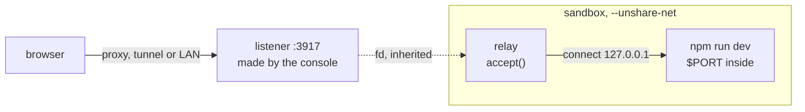

# Jobs

A **job** is a command a session keeps running in the background: a dev server somebody opens in a
browser, a file watcher, a test run too long to sit on. It is started by the person's `Run`, by the
model's `start_job`, or by a plugin's setup, and all three are kept the same way. This page covers how
a job is recorded and kept running, how a job that serves reaches a browser through a sandbox with no
network, and what the model is told. How a command is confined at all is [where a command
runs](sandbox.md); what crosses the boundary and why is [what runs, and as whom](security.md).

## The checkpoint says which jobs should be running

**A job is a command entry carrying `job`, and one with no `result:{entry}` beside it is one that
should be running.** That is the whole of the desired state, and `jobs.py` is a reconciler over it:
it reads a session's checkpoint, starts what is wanted and not running, and stops what is running
and not wanted. So:

- **Stopping one is writing its result.** The panel's Stop and the model's `stop_job` both end the
  process, and its own run writes the exit status, what it printed and why it ended; a job that is
  wanted and not running in this process has its result written directly. Nothing starts a job with
  a result.
- **Archiving ends them.** An archived session wants nothing, so the look the press asks for stops
  each job, and the result says the session was archived.
- **A fork does not start its parent's.** A job's entry comes across like any command's, and with no
  result beside it the branch would want a second process, perhaps on a second port, in a checkout
  it has not planted yet. So the fork is given a result for each, saying it was not carried. A job a
  setup declared is started again by the branch's own setup.
- **A command an older console was killed under is never started again.** It has no `job` field, so
  it is not a job, whatever its lack of a result says.

`job` is a field on `records.Command` rather than an arm of its own, which is the push's bargain
again: an unknown field survives a rollback and an unknown kind does not. A build that predates it
draws a job as a command with no result yet, which is what a running job is.

## A console restarting is not an end, so a job must be idempotent

Shutting down kills every job's namespace and writes nothing, so the next console's first look finds
the same entries still wanting jobs and starts each again, from the top, in the checkout as it is
then, on the same port. What it prints begins with a line saying so.

**There is one behaviour here rather than a setting**, which is what makes this rule the job's to
keep rather than the console's: a dev server or a watcher is idempotent already, and a migration or
a deploy has to be written to be safe to run twice. The model's `start_job`, a setup's `jobs` and
this page all say so. A setting choosing between "start again" and "record it as unfinished" would be
the second path a job could take, and every job would have to be right under both.

**A job is restarted, never resumed.** What it held in memory is gone, and nothing bounds how long one
runs: `Run` has no timeout, because a job is over when it exits or somebody stops it.

**The reconciler looks when this process writes, and at startup.** Every start reconciles its own
session before it returns, so the model's `start_job` can say what port it got, and archiving asks for
a look. What that costs, stated: a job recorded by a worker in another process is noticed at the next
look or the next restart, not at once. A timer sweeping every session would close that, for a load
of every checkpoint per interval on a console with nothing to do.

## The port is handed in

A session with its network off runs a job behind `--unshare-net`, so all a server can listen on is
the sandbox's own loopback, which nothing outside can reach. **For a job that names a `port`, the
console makes the listening socket itself, on its own host, and passes it into the sandbox as an open
file**; a relay inside accepts on it and connects to that port there. The job is handed the port as
`$PORT` too.

That works because a socket stays in the network namespace it was created in, whichever process
holds it: the relay accepts connections on the host's network without being able to *make* a socket
there, so the sandbox still reaches nothing. `test_jobs.py` holds both halves, a page served from
inside fetched from outside with the session's network off.

**What crosses is one descriptor this console made, and nothing comes back.** That is the line
[security](security.md#nothing-trusted-may-discover-its-inputs-from-a-writable-tree) draws: being
handed a value is safe and going and finding one is not. The tempting alternative is a Unix socket
the server listens on in a directory the sandbox can write, which this side then connects to and
proxies. It works, and it is this process opening a path the sandbox can plant a link at: a link to
the Docker socket, which also speaks HTTP, would make the person's browser a client of it. It also
puts every byte through the console. Do not build it.

**There are two ports, and each side knows only its own.** The inside port is the one the job names.
The outside port is the one the console listens on, chosen from `serving_lowest` to `serving_highest`,
recorded under `listening:{entry}` the first time the job starts, and reused after a restart so a link
somebody has open keeps working. The inside number is tried outside first, so the server's own
startup line and the link agree wherever that port is free.

**A session with the network on has no relay.** Its sandbox shares the host's network, so the server
listens on the host directly and the port it names is the port it is opened on. The cost is that two
connected sessions cannot both serve on 5173, and that such a server is reachable on this host by
anything else on it.

**A killed namespace is not gone at once.** Killing `bwrap` is immediate; the relay holding the
listener is reaped a moment later. So listening on a recorded port waits out a holder that is going,
for `RELEASE`, and a job's result is written only once its port is free, which is what makes a job
recorded as ended one whose port can be taken. A port still held after that is somebody else's, and
is the job's result rather than a move to another port nobody's tab knows.

**The relay is run by the machine's `python3`**, since this project's interpreter is not in the
sandbox, so it is held to the grammar the bundled plugins are. It tries IPv4 loopback and then IPv6,
because a server told "localhost" may bind either.

## How a browser reaches it

**The console listens for jobs on the address it listens on itself.** Whatever reaches the console
reaches its jobs on another port: on exe.dev the proxy forwards every port from 3000 to 9999,
privately, which is why that is the default range; a tailnet or a LAN reaches them directly; an
`ssh -L` needs one more forward per job, which is the cost of ports over paths. Nothing here is
specific to exe.dev, and the range is the only setting that is.

**A job is opened through a route, not linked to directly.** The address is this console's host as
the browser reached it, which only the request knows (`X-Forwarded-Host` behind a proxy), and a page
may ask nothing. So the panel links to `/sessions/{session}/jobs/{entry}` and that answers a redirect
to the port.

**Its own origin, never the console's.** A path under the console would run the server's scripts,
the repository's or the model's, with this console's whole authority, and dev servers break under a
path prefix anyway. A port is a different origin. It is still the same *site*, which is what
[`origins.py`](security.md#a-write-is-answered-only-from-the-consoles-own-page) exists for.

**The server sees a `Host` it was not told about**, `vm.example:3917` behind a proxy, and frameworks
that check it refuse the request: Vite's `server.allowedHosts`, Next.js's `allowedDevOrigins`. The
console cannot know its public name before a request arrives, so it hands the job nothing, and the
model is told to allow any host instead.

## What the person sees

A job's panel is a command's, with what started it in front of the line where that was the model or a
plugin. While it runs it carries a link to what it has printed so far, a link to open it where it
serves, and a disclosure that stops it. What it printed is not recorded until it ends, since a
server's output is endless, so the running log is read out of this process by a route of its own.
Once it has ended, the panel is a finished command's.

There is no `/serve`. Assembling the command and the port a project's server wants is the model's
job, and `Run` is what the person types into: it is a job like any other, so a long build typed there
can be read while it runs and stopped.

## What the model is told

`start_job`, `list_jobs`, `read_job`, `wait_job` and `stop_job`, offered wherever `bash` is, since a
job runs in the sandbox a command runs in. **The descriptions are the model's whole picture of this,
and `start_job`'s is long on purpose**, because a job here differs from a background process in a
terminal in exactly the ways a model would otherwise waste turns on:

- its own `bash` cannot reach it, since every command has a namespace of its own, so it reads a job
  with `read_job` and waits with `wait_job`, and checks a page by starting a server inside one command;
- it must be idempotent, since a console restart starts it again;
- one that serves names its `port` and listens on `127.0.0.1` there, as `$PORT`;
- the person opens a server at another host and port, so a framework checking `Host` has to allow any;
- starting the same command twice starts two.

`start_job` records the call that asked for it on the entry, as `{turn}:{call}`, and looks for that
before appending, so a pass that fell over after the entry landed and before the return was recorded
runs the call again and finds the job it already started. The cost is five more tool definitions in
the prefix of every session with a shell, the artifact tools' cost again.

**`wait_job` holds the pass for at most ten minutes**, `bash`'s bound for the same reason. The store
has what a longer wait wants, `Run.awaiting` suspending a pass until another writer supplies a key,
and a job's result is exactly such a key; what is not yet known is whether that suspension can travel
out through a tool call inside the model loop.

**A job the model started tells the model when it ends.** A model that starts a test run and ends its
turn without waiting would otherwise leave a session nobody answers until somebody types. So when such
a job ends, other than by the model's own `stop_job`, the console delivers a message saying which job
ended, how, and its last lines: a running turn takes it as a steer, and an idle session opens a turn
on it. It is a steer whose text says it is the console's, since a steer is drawn as what the person
said and nothing else would tell the two apart. The person's own jobs are never told, as nothing the
person runs is, and neither is a setup's, which the model did not start.

## A setup can declare jobs

A plugin's `setup` answer may carry `jobs`, each a `command` and an optional `port`, and the pass
that records the setup starts them once both registrations are down. That is how a session gets the
dev server it always wants without anybody asking the model: this repository's own setup declares
`.mainplate/demo`, the demo console on its seeded fixtures, so every session working on mainplate has
one running beside it.

**A setup contribution rather than an effect**, because setup's answer is a declaration of what the
plugin contributes, and a job is one more thing a session gets when it is set up. Each is started
under a name made of the session, the plugin and its place in the list, so a pass that fell over
between the registrations and the last start finds which are missing; the session's own id is in the
name because a fork carries its parent's jobs as ended and runs the same setup again.
